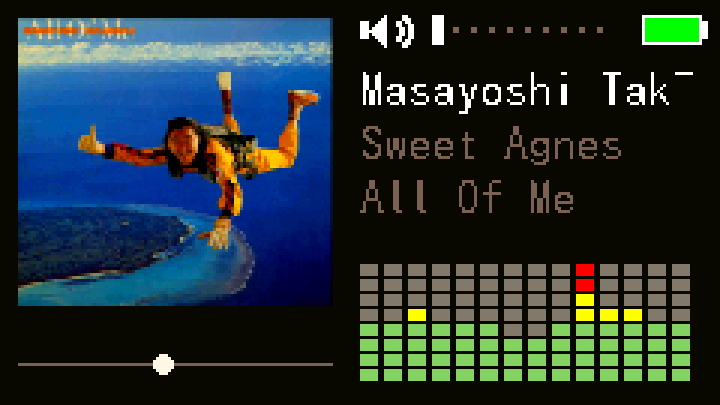
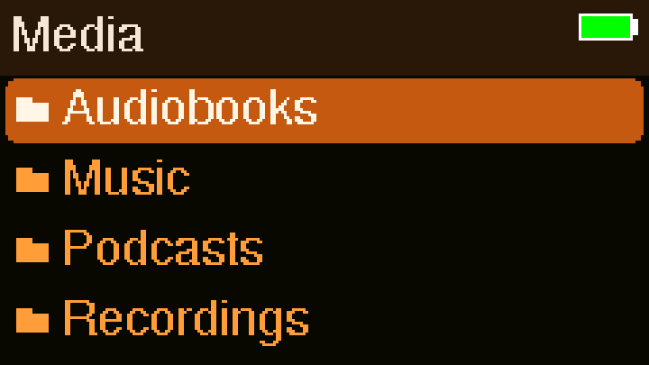
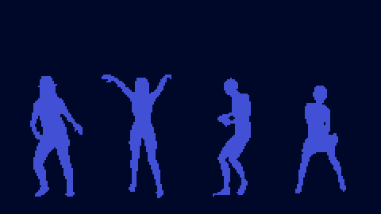
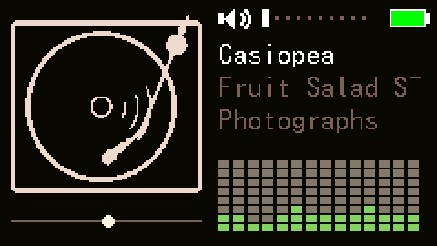
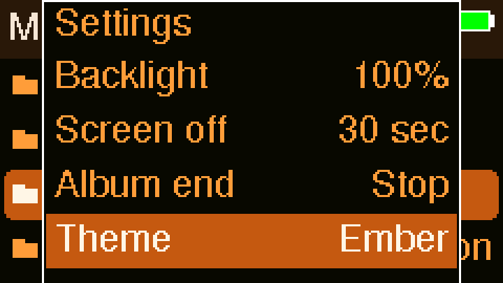

# Ember

A themeable MP3 / FLAC / WAV player firmware for the [M5Stack Cardputer ADV](https://docs.m5stack.com/en/core/Cardputer%20ADV) (ESP32-S3). SD-card folder browsing, custom color themes, a couple of full-screen visualizers, and no companion app required.

<p float="left">
  
  
</p>

## In motion

| Full-screen dancer visualizer | Turntable placeholder | Theme cycling |
|:---:|:---:|:---:|
|  |  |  |

## Features

- **Folder browsing** straight off the SD card (Artist → Album → Track), natural-sorted, no library scan/database step.
- **MP3, FLAC, and WAV** playback.
- **Themeable UI** — 6 built-in themes (Ember, 90's Sweater, Aqua, Honey, Moody, Terminal Green), plus a [browser-based theme editor](#custom-themes) for making your own and loading them from the SD card, no recompiling required.
- **Two full-screen visualizers**: a real FFT spectrum analyzer (bars + peak-hold + waveform overlay + stereo level meter), and a full-screen silhouette dance visualizer that reacts to bass hits in the music.
- **Now Playing extras**: embedded album art (JPEG/PNG/BMP/QOI), an animated turntable placeholder for tracks with no art, a small amplitude visualizer, seek with double-tap-to-restart/skip, and battery/volume meters.
- **Settings**: backlight level, screen-off timeout, end-of-album behavior, and theme — all persisted across reboots.
- **On-device screenshot capture** (see [Screenshots](#taking-your-own-screenshots) below) for pulling real UI captures without photographing the screen.

## Hardware

- M5Stack Cardputer ADV (ESP32-S3, no PSRAM).
- A microSD card for your music (and optionally custom themes — see below).

## Building / flashing

This is a [PlatformIO](https://platformio.org/) project.

```
git clone https://github.com/HorseyofCoursey/EMBER.git
cd EMBER
pio run --target upload
```

Everything lives in `src/main.cpp`; there's no separate config step. See `CLAUDE.md` for the hardware/architecture constraints if you're planning to modify it.

## Controls

The Cardputer has no dedicated arrow keys — the punctuation cluster doubles as one: `;` `.` `,` `/` map to up/down/back/open.

| Key | Action |
|---|---|
| `;` / `.` | Move selection up/down in the file browser |
| `,` | Back / up a folder (at the root, opens Now Playing instead) |
| `/` | Open selected folder or track |
| `` ` `` | Back, from anywhere |
| Enter | Open / play |
| Space | Play / pause |
| `,` / `/` (Now Playing) | Seek back/forward; double-tap to restart / skip to next track |
| `n` / `p` | Next / previous track |
| `-` / `=` | Volume down / up |
| `m` | Toggle Now Playing screen |
| `v` (Now Playing) | Cycle full-screen visualizer: spectrum → dancers → back |
| `a` (Now Playing) | Toggle turntable placeholder vs. real album art |
| `s` | Settings |
| `c` | Save a screenshot to `/screenshots` on the SD card (hold to burst-capture) |

## Custom themes

Every color in the UI — backgrounds, text, selection highlight, visualizer tiers, all of it — comes from one theme struct, editable without touching any drawing code.

**Make your own:** open the [theme editor](https://horseyofcoursey.github.io/EMBER/tools/theme-editor.html) in a browser. It shows a live, device-accurate preview (colors are quantized to the Cardputer's actual 16-bit display depth, so what you see is what you'll get) of the browser, Now Playing, and visualizer screens as you tweak each color.

**Use it on your device (no recompiling):** on the JSON tab, click **Download**, then copy the file into a `/themes` folder on your SD card. After a reboot, it shows up as an extra option under **Settings → Theme**.

**Contribute it back:** switch to the `main.cpp` tab instead, copy the generated struct, and open a PR or issue with it — that gets it built into the firmware for everyone, not just your SD card.

The editor also works completely offline as a local file (`tools/theme-editor.html`) if you'd rather not use the hosted copy.

## Taking your own screenshots

Press `c` on any screen to save a BMP to `/screenshots` on the SD card; hold it to burst-capture a sequence (useful for the animated screens). There's no timestamp metadata (no RTC on this board), so if you need to tell capture sessions apart afterward, diffing consecutive frames for content changes works well.

## License

[MIT](LICENSE)
