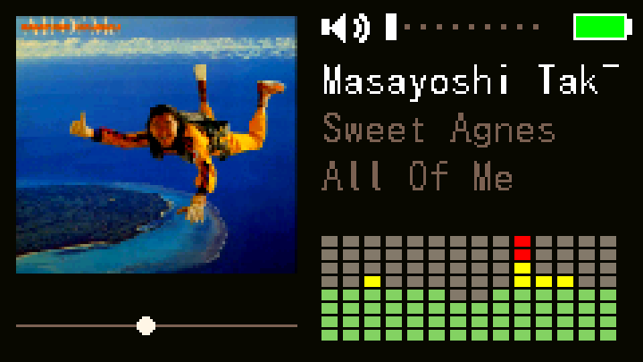
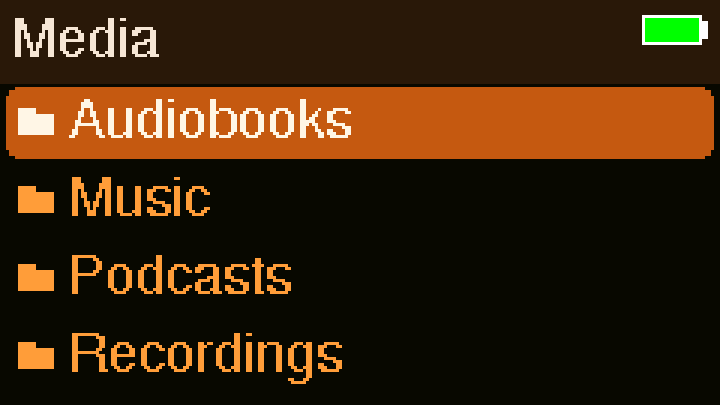
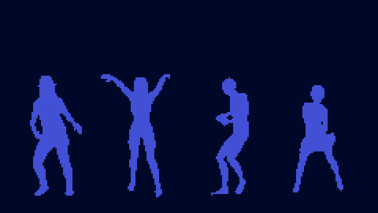
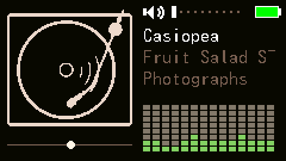

[](https://opensource.org/licenses/MIT)
[](https://buymeacoffee.com/horseyofcoursey)

A themeable MP3 / FLAC / WAV / AAC player firmware for the [M5Stack Cardputer ADV](https://shop.m5stack.com/products/m5stack-cardputer-adv-version-esp32-s3) (ESP32-S3). SD-card folder browsing, album art, custom color themes, full-screen visualizers, optional external stereo audio output, and (in a separate build) remote streaming from a Gonic server.

## Which build do I want?

This board has no PSRAM, and there isn't enough spare RAM to keep both the full-screen visualizers and Subsonic/Gonic networking reliable at the same time — so EMBER ships as two builds instead of one:

| | Default (`ember-cardputer-adv.bin`) | Gonic (`ember-cardputer-adv-gonic.bin`) |
|---|---|---|
| Where | M5Burner / M5Launcher, and this repo | [GitHub Releases](../../releases) only |
| Full-screen visualizers (`v`) | ✅ | ❌ (key does nothing) |
| Subsonic/Gonic streaming (`w`) | ❌ (key does nothing) | ✅ |
| Everything else (themes, pagination, art, DAC output, etc.) | ✅ | ✅ |

If you don't use Gonic, you want the default build — it's what M5Burner gives you already. Only grab the Gonic build from Releases if you specifically want network streaming and are fine trading away the full-screen visualizers for it.


<p float="left">
  
  
  
</p>

## In motion

| Full-screen dancer visualizer | Turntable placeholder | Theme cycling |
|:---:|:---:|:---:|
|  |  |  |

## Features

- **Folder browsing** straight off the SD card (Artist → Album → Track), natural-sorted, paginated so folders of any size browse without a hard entry cap.
- **MP3, FLAC, WAV, and AAC** playback from the SD card.
- **Remote streaming from Gonic** (Gonic build only — see [above](#which-build-do-i-want)) — connect to a [Gonic](https://github.com/sentriz/gonic) server over WiFi and browse Artists → Albums → Songs without anything on the SD card. Supports seeking, a progress bar, and automatic MP3/FLAC/WAV format detection. Built against the standard Subsonic API, so other Subsonic-compatible servers (Navidrome, Airsonic, etc.) may also work, but only Gonic has actually been tested.
- **Themeable UI** — 9 built-in themes (Ember, 90's Sweater, Aqua, Honey, Moody, Terminal Green, Tokyo Night, Amber on Black, iPuter), plus a [browser-based theme editor](#custom-themes) for making your own and loading them from the SD card, no recompiling required.
- **Two full-screen visualizers** (default build only): a real FFT spectrum analyzer (bars + peak-hold + waveform overlay + stereo level meter), and a full-screen silhouette dance visualizer that reacts to bass hits in the music.
- **Selectable small visualizer styles** on the Now Playing screen — Bars, Peaks, or Mirror.
- **Now Playing extras**: embedded album art (JPEG/PNG/BMP/QOI) for SD tracks, an animated turntable placeholder for tracks with no art (or any remote track), a small amplitude visualizer, seek with double-tap-to-restart/skip, and battery/volume meters.
- **Optional external stereo audio output** — drive a UDA1334A DAC breakout off the Cardputer ADV's second, otherwise-unused I2S peripheral for real stereo line/headphone output, independent of the internal mono speaker. Toggle in Settings → Audio output (defaults to internal).
- **Settings**: backlight level, screen-off timeout, end-of-album behavior, audio output, and theme — all persisted across reboots.
- **On-device screenshot capture** (see [Screenshots](#taking-your-own-screenshots) below) for pulling real UI captures without photographing the screen.
- **Multi-language support** displays Japanese, Chinese, Cyrillic (Russian, etc.), Greek, and accented Latin (French, German, Spanish, etc). 

## Hardware

- M5Stack Cardputer ADV (ESP32-S3, no PSRAM).
- A microSD card for your music (and optionally custom themes — see below).
- *Optional:* a UDA1334A I2S DAC breakout for external stereo audio output — see [External audio output](#external-stereo-audio-output).

## Controls

The Cardputer has no dedicated arrow keys — the punctuation cluster doubles as one: `;` `.` `,` `/` map to up/down/back/open.

| Key | Action |
|---|---|
| `;` / `.` | Move selection up/down in the file browser |
| `,` | Back / up a folder (at the root, opens Now Playing instead) |
| `/` | Open selected folder or track |
| `` ` `` | Back, from anywhere |
| Enter | Open / play |
| Space | Play / pause |
| `,` / `/` (Now Playing) | Seek back/forward; double-tap to restart / skip to next track |
| `n` / `b` | Next / previous track |
| `-` / `=` | Volume down / up |
| `m` | Toggle Now Playing screen |
| `v` (Now Playing) | Cycle full-screen visualizer: spectrum → dancers → back (default build only) |
| `z` (Now Playing) | Cycle the small visualizer's style: Bars → Peaks → Mirror |
| `a` (Now Playing) | Toggle turntable placeholder vs. real album art (SD playback only) |
| `w` | Open/close the network player, browse a Subsonic/Gonic server (Gonic build only) |
| `s` | Settings |
| `c` | Save a screenshot to `/screenshots` on the SD card (hold to burst-capture) |

## Streaming from Subsonic/Gonic

Requires the **Gonic build** (`ember-cardputer-adv-gonic.bin` from [Releases](../../releases) — the default M5Burner build doesn't include this, see [Which build do I want?](#which-build-do-i-want)).

Press `w` from anywhere (except Settings) to connect to a server and browse Artists → Albums → Songs over WiFi, the same way you'd browse the SD card. This has only been tested against [Gonic](https://github.com/sentriz/gonic); it's built on the standard Subsonic API, so other compatible servers may work but aren't verified.

**Setup:** drop two plain-text files on the SD card root — no on-device typing needed.

`/wifi.txt`
```
YourSSID
YourWiFiPassword
```

`/subsonic.txt`
```
http://your-server-address:port
username
password
```

Gonic defaults to port `4747`; Navidrome defaults to `4533` — don't assume either.

**Known limitations:**
- Real album art isn't fetched for remote tracks yet — the spinning-record placeholder shows instead.
- The full-screen visualizer (`v`) isn't in this build at all — see [Which build do I want?](#which-build-do-i-want) for why.
- AAC streams currently fail to decode over the network — MP3, FLAC, and WAV all work.

## External stereo audio output

The Cardputer ADV's built-in speaker runs off one of the ESP32-S3's two I2S peripherals, leaving the second one completely unused. Wiring a UDA1334A DAC breakout (e.g. [Adafruit's](https://www.adafruit.com/product/3678), or a generic clone) to it gives you real stereo line/headphone output alongside (not instead of) the internal speaker.

**Wiring** (DAC pin → Cardputer ADV pin):

| DAC pin | Cardputer ADV pin |
|---|---|
| VIN | 5V |
| GND | GND |
| BCLK | GPIO5 |
| WSEL (LRCLK) | GPIO6 |
| DIN | GPIO3 |

MCLK is left disconnected — the UDA1334A doesn't need it. GPIO5/6 are the ADV-specific "external" pins broken out on the rear header (on the original, non-ADV Cardputer, these same physical pins are wired internally to the keyboard matrix instead — don't reuse this wiring on that board).

Enable it in **Settings → Audio output** (defaults to internal) once wired up.

**Stereo Hat-Hat**
[This stl will house the stereo board.](https://www.printables.com/model/1861468-stereo-hat-hat-for-the-cardputer)


## Custom themes

Every color in the UI — backgrounds, text, selection highlight, visualizer tiers, all of it — comes from one theme struct, editable without touching any drawing code.

**Make your own:** open the [theme editor](https://horseyofcoursey.github.io/EMBER/tools/theme-editor.html) in a browser. It shows a live, device-accurate preview (colors are quantized to the Cardputer's actual 16-bit display depth, so what you see is what you'll get) of the browser, Now Playing, and visualizer screens as you tweak each color.

**Use it on your device (no recompiling):** on the JSON tab, click **Download**, then copy the file into a `/themes` folder on your SD card. After a reboot, it shows up as an extra option under **Settings → Theme**.

The editor also works completely offline as a local file (`tools/theme-editor.html`) if you'd rather not use the hosted copy.

## Taking your own screenshots

Press `c` on any screen to save a BMP to `/screenshots` on the SD card; hold it to burst-capture a sequence (useful for the animated screens). There's no timestamp metadata (no RTC on this board), so if you need to tell capture sessions apart afterward, diffing consecutive frames for content changes works well.

## Credit
Thank you to the creators of the following repositories (in no particular order) that inspired this project and provided a code base to start.
[BrokenSignal-Plus](https://github.com/mr-f0xx/BrokenSignal-Plus) - mr-f0xx     
[AdvanceOS-for-cardputer](https://github.com/bomberman30/AdvanceOS-for-cardputer) - bomberman30  
[MP3PlayerforM5Cardputer](https://github.com/sanchitminda/MP3PlayerForM5Cardputer) -  sanchitminda  
[CardPuter_Mp3_Adv](https://github.com/vicliu624/CardPuter_Mp3_Adv) - vicliu624  
[M5Mp3](https://github.com/VolosR/M5Mp3) - VolosR


## License

[MIT](LICENSE)

[](https://buymeacoffee.com/horseyofcoursey)
